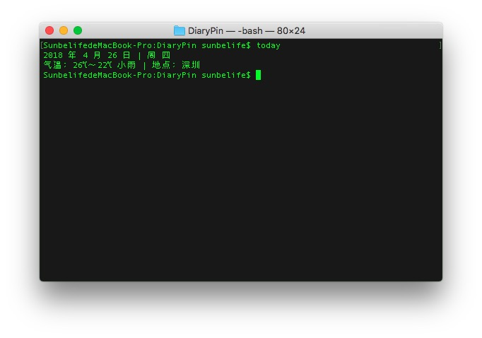

# DiaryPin
####on macOS：

add a a time/weather statics to your Diary 

After you type

```sh install.sh```

Then just reopen your terminal and type

```today```

you can get the message like this:



and then add this to your clipboard will automatically.

#### On Windows:

you need to install Python3 manually.

And then use pip3 to install some modules:

```pip3 install pip Pinyin request pq pyperclip xpinyin pyquery```

And type this : (make sure you entered the folder of DiaryPin)

```python3 Diarypin.py```


Special thanks to my workmate who give me this inspiration:

Xiang Huang